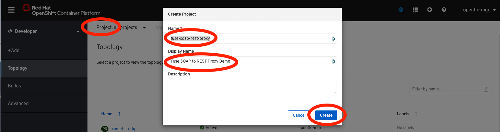
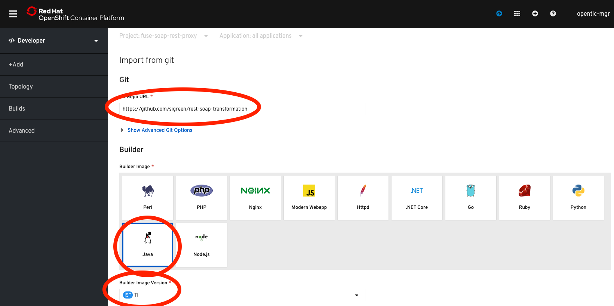
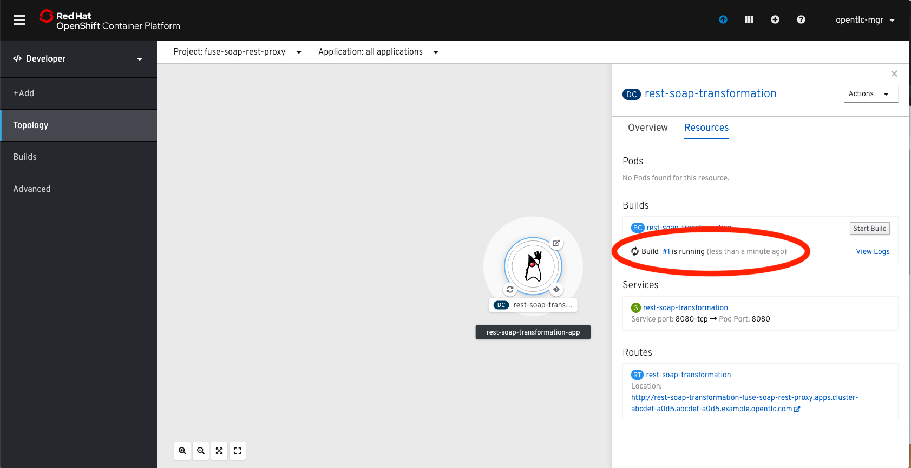
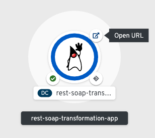
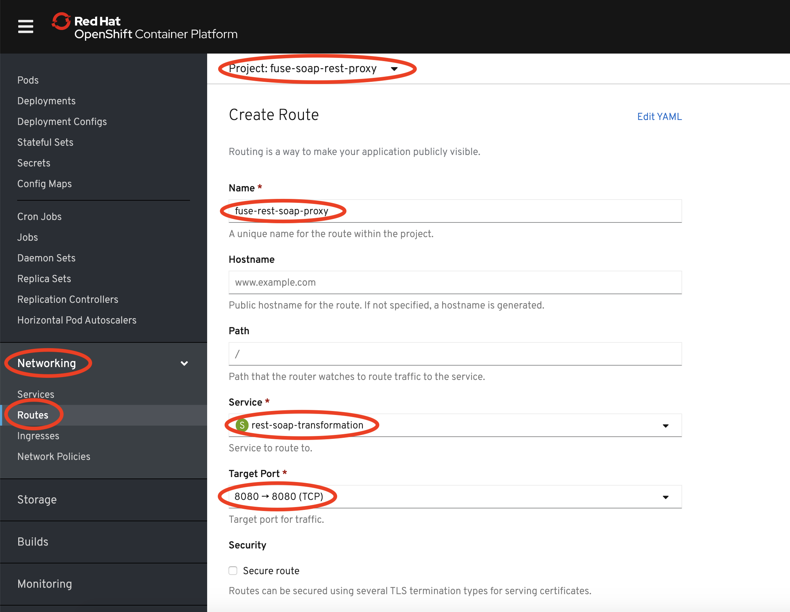
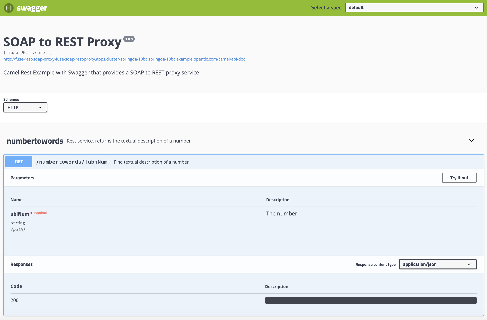
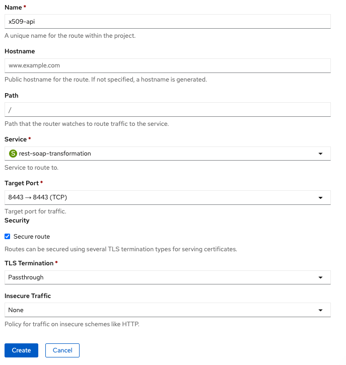
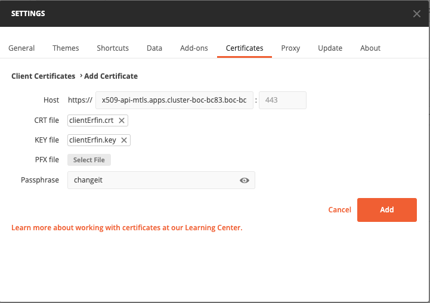
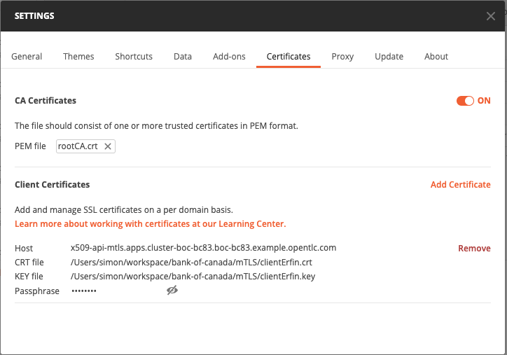
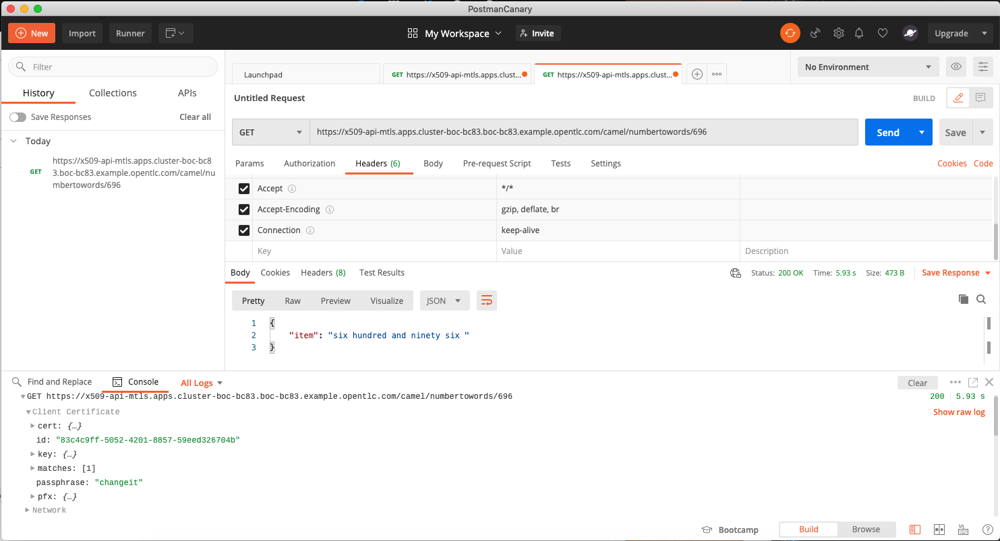

Fuse 7.4 SOAP to REST Proxy Demo on OpenShift 4.2
====================================

Demonstration of a SOAP to REST Proxy for existing SOAP service, using the Fuse 7.4 image stream.  A video walkthrough demonstrating this project can be found [here](https://youtu.be/TLOLWMeobuU).

## Overview

This project demonstrates a microservices based project leveraging SpringBoot and Apache Camel to proxy an existing SOAP service with a new REST front-end service.  Additionally, the REST API is documented using Swagger / OpenAPI.  The project makes use of camel-servlet component listening on port 8080 and configured using SpringBoot.

## Prerequisites

An OpenShift 4.2 environment must be present for deployment to to a cloud environment.  For the purpose of testing, I prefer to use [Minishift](https://fabric8.io/guide/getStarted/minishift.html).  Unfortunately, OpenShift 4.x does not yet support SpringBoot 2, therefore we will stick with v1.5 for this project.

## Deployment

This project can be deployed using two methods:

* Standalone Spring-Boot container
* On an Openshift 4.2 environment using Fuse 7.4.

## Standalone Spring Boot Container

The standalone method takes advantage of the [Camel Spring Boot Plugin](http://camel.apache.org/spring-boot.html) to build and run the microservice.

Execute the following command from the root project directory:

```
mvn spring-boot:run -Dspring.profiles.active=dev
```

Once the spring boot service has started, you can test the REST API by navigating

```
curl -X GET "http://localhost:8080/camel/numbertowords/737373" -H "accept: application/json"
```

The number written in words is returned in JSON format.  Try other numbers as needed.

It's also possible to navigate the REST service using the Swagger / OpenAPI documentation [here](http://localhost:8080/swagger-ui.html).

## Openshift 4.x S2I Build / Deploy

The easiest method to deploy this example is to use the standard Openshift S2I build Method.

1. Login to the OpenShift Developer Web Console using your credentials.
2. Click on Project then *Create Project*.  Give the project name: `fuse-soap-rest-proxy` and description: `Fuse SOAP to REST Proxy Demo`.  Click **Create**.

3. On the Topology page, click *+Add* then *From Git*
4. In the *Git Repo URL* field, enter this repo URL: `https://github.com/sigreen/rest-soap-transformation`.  Select **Java** as the *Builder Image*, and **11** as the *Builder Image Version*.  Click on *Create*.

5. Give the build a couple of minutes to build and deploy. If you click on the blue circle, you should see under the *Resources* tab that build is running.

6.  Once the deployment has finished, click on the URL link and append the following to the URI: `/swagger-ui.html`.



## Openshift / Minishift Deployment (Fabric8 MVN Plugin)

First, create a new OpenShift project called *fuse-soap-rest-proxy*

```
oc new-project fuse-soap-rest-proxy --description="Fuse SOAP to REST Proxy Demo" --display-name="SOAP REST Proxy"
```

Execute the following command which will execute the *openshift* profile that executes the `clean fabric8:deploy` maven goal:

```
mvn -Popenshift
```

The fabric8 maven plugin will perform the following actions:

* Compiles and packages the Java artifact
* Creates the OpenShift API objects
* Starts a Source to Image (S2I) binary build using the previously packaged artifact
* Deploys the application using binary streams

## Create the OCP route

Once the container is deployed, open the OCP web UI and navigate to the *fuse-soap-rest-proxy* project.  Navigate to *Networking > Routes* the click *Create Route*.  Enter the details for the new route as shown below:



## Swagger UI

A [Swagger User Interface](http://swagger.io/swagger-ui/) is available within the rest-soap-transformation application to view and invoke the available services.  Click the above route location (link), and append `/swagger-ui.html` when the page opens.  This should display the below Swagger interface:



The raw swagger definition can also be found at the context path `/camel/api-doc`

## Command Line Testing

Using a command line, execute the following to query the definition service

```
curl -s http://$(oc get routes fuse-rest-soap-proxy --template='{{ .spec.host }}')/camel/numbertowords/737373 | python -m json.tool
```

A successful response will output the following

```json
{
    "item": "seven hundred and thirty seven thousand three hundred and seventy three "
}
```

## Adding two-way SSL / mutual TLS

If you'd like to add client certificate (two-way SSL) to the mix when running on OCP, this is achievable by the following procedure:


1. Create a new Openshift project via the following CLI:

```
oc new-project mtls --description="Mutual TLS REST to SOAP" --display-name="mTLS REST to SOAP"
```

2. Locally, create the following directory:

```
mkdir mTLS
cd mTLS
```

3. Via your CLI, set the Apps route name to your OCP environment apps route name:

```
export APPSHOST=apps.cluster-boc-bc83.boc-bc83.example.opentlc.com
```

4. Create the root CA. Use `changeit` as the password, and ensure the CN matches the following entry: `echo x509-api-mtls.$APPSHOST` :

```
openssl req -x509 -sha256 -days 3650 -newkey rsa:4096 -keyout rootCA.key -out rootCA.crt
Generating a 4096 bit RSA private key
..............................++
..........................++
writing new private key to 'rootCA.key'
Enter PEM pass phrase:
Verifying - Enter PEM pass phrase:
-----
You are about to be asked to enter information that will be incorporated
into your certificate request.
What you are about to enter is what is called a Distinguished Name or a DN.
There are quite a few fields but you can leave some blank
For some fields there will be a default value,
If you enter '.', the field will be left blank.
-----
Country Name (2 letter code) []:us
State or Province Name (full name) []:vt
Locality Name (eg, city) []:newport
Organization Name (eg, company) []:redhat
Organizational Unit Name (eg, section) []:sales
Common Name (eg, fully qualified host name) []:x509-api-mtls.$APPSHOST
Email Address []:sigreen@redhat.com
```

5. Create the key, using `changeit` as the password and ensuring the CN matches below (`echo x509-api-mtls.$APPSHOST`):

```
openssl req -new -newkey rsa:4096 -keyout localhost.key
Generating a 4096 bit RSA private key
............................................................................................................................................................................................................................................................................................................++
............................................................................................................................................................................................................................................................................................++
writing new private key to 'localhost.key'
Enter PEM pass phrase:
Verifying - Enter PEM pass phrase:
-----
You are about to be asked to enter information that will be incorporated
into your certificate request.
What you are about to enter is what is called a Distinguished Name or a DN.
There are quite a few fields but you can leave some blank
For some fields there will be a default value,
If you enter '.', the field will be left blank.
-----
Country Name (2 letter code) []:us
State or Province Name (full name) []:vt
Locality Name (eg, city) []:newport
Organization Name (eg, company) []:redhat
Organizational Unit Name (eg, section) []:sales
Common Name (eg, fully qualified host name) []:x509-api-mtls.$APPSHOST
Email Address []:sigreen@redhat.com

Please enter the following 'extra' attributes
to be sent with your certificate request
A challenge password []:changeit
```

6. Create the certificate signing request by copying the output of the previous command and pasting into VI:

```
vi localhost.csr
```

7. Add the following information to `localhost.ext`, but be sure to enter the correct DNS entry (you find this by typing `echo x509-api-mtls.$APPSHOST`):

```
vi localhost.ext
...
authorityKeyIdentifier=keyid,issuer
basicConstraints=CA:FALSE
subjectAltName = @alt_names
[alt_names]
DNS.1 = x509-api-mtls.<your apps hostname>
...
```

8. Create the private key:

```
openssl x509 -req -CA rootCA.crt -CAkey rootCA.key -in localhost.csr -out localhost.crt -days 365 -CAcreateserial -extfile localhost.ext
Signature ok
subject=/C=us/ST=vt/L=newport/O=redhat/OU=sales/CN=x509-api-mtls.apps.cluster-boc-7eee.boc-7eee.example.opentlc.com/emailAddress=sigreen@redhat.com
Getting CA Private Key
Enter pass phrase for rootCA.key:
```

9. Create the keystore:

```
openssl pkcs12 -export -out localhost.p12 -name "x509-api-mtls" -inkey localhost.key -in localhost.crt
```

10. Create the JKS keystore:

```
keytool -importkeystore -srckeystore localhost.p12 -srcstoretype PKCS12 -destkeystore keystore.jks -deststoretype JKS
```

11. Creat the JKS trustore:

```
keytool -import -trustcacerts -noprompt -alias ca -ext san=dns:x509-api-mtls.<enter your apps hostname> -file rootCA.crt -keystore truststore.jks
```

12. Create the config map:

```
mkdir security-config
cp keystore.jks security-config/keystore.jks
cp truststore.jks security-config/truststore.jks
oc create configmap my-x509-config --from-file=security-config/
```

13. Via the IDE, update the `src/main/resources/application.properties with the following:

```
# lets use a different management port in case you need to listen to HTTP requests on 8080
management.server.port=8081
management.server.ssl.enabled=false

# disable all management endpoints except health
endpoints.enabled = false
endpoints.health.enabled = true

springfox.documentation.swagger.v2.path=/camel/api-doc

server.port=8443
server.ssl.enabled=true
server.ssl.client-auth=need
server.ssl.key-store=/my-x509-config/keystore.jks
server.ssl.key-store-password=changeit
server.ssl.trust-store=/my-x509-config/truststore.jks
server.ssl.trust-store-password=changeit
```

14. Update camel-context.xml scheme to "https":

```
...
        <restConfiguration apiContextPath="/api-doc" bindingMode="off"
            component="servlet" contextPath="/camel" enableCORS="true" scheme="https">
            <dataFormatProperty key="prettyPrint" value="true"/>
            <apiProperty key="host" value=""/>
            <apiProperty key="api.version" value="1.0.0"/>
            <apiProperty key="api.title" value="SOAP to REST Proxy"/>
            <apiProperty key="api.description" value="Camel Rest Example with Swagger that provides a SOAP to REST proxy service"/>
            <apiProperty key="api.contact.name" value="Simon Green"/>
        </restConfiguration>
...
```

15. Via the CLI, execute the following:

```
cd ../rest-soap-transformation
mvn -P openshift clean install fabric8:deploy
```

16. Create the route using the following configuration:



17. Before testing, we need to create the client certicates using `changeit` as the password:

```
cd ../mtls
openssl req -new -newkey rsa:4096 -nodes -keyout clientErfin.key
Generating a 4096 bit RSA private key
..................................................................................++
......................................................++
writing new private key to 'clientErfin.key'
-----
You are about to be asked to enter information that will be incorporated
into your certificate request.
What you are about to enter is what is called a Distinguished Name or a DN.
There are quite a few fields but you can leave some blank
For some fields there will be a default value,
If you enter '.', the field will be left blank.
-----
Country Name (2 letter code) []:vt
State or Province Name (full name) []:^C
sigreen-macbook:mtls simon$ openssl req -new -newkey rsa:4096 -nodes -keyout clientErfin.key
Generating a 4096 bit RSA private key
...............++
....................................................................................................................................................................++
writing new private key to 'clientErfin.key'
-----
You are about to be asked to enter information that will be incorporated
into your certificate request.
What you are about to enter is what is called a Distinguished Name or a DN.
There are quite a few fields but you can leave some blank
For some fields there will be a default value,
If you enter '.', the field will be left blank.
-----
Country Name (2 letter code) []:us
State or Province Name (full name) []:vt
Locality Name (eg, city) []:newport
Organization Name (eg, company) []:redhat
Organizational Unit Name (eg, section) []:sales
Common Name (eg, fully qualified host name) []:x509-api-mtls.apps.cluster-boc-7eee.boc-7eee.example.opentlc.com
Email Address []:sigreen@redhat.com

Please enter the following 'extra' attributes
to be sent with your certificate request
A challenge password []:changeit
```

18. Create the client signing request:

```
vi clientErfin.csr
-----BEGIN CERTIFICATE REQUEST-----

...
-----END CERTIFICATE REQUEST-----
```

19. Create the client key:

```
openssl x509 -req -CA rootCA.crt -CAkey rootCA.key -in clientErfin.csr -out clientErfin.crt -days 365 -CAcreateserial
Signature ok
subject=/C=us/ST=vt/L=newport/O=redhat/OU=sales/CN=x509-api-mtls.apps.cluster-boc-7eee.boc-7eee.example.opentlc.com/emailAddress=sigreen@redhat.com
Getting CA Private Key
Enter pass phrase for rootCA.key:
```

20. Create the client keystore:

```
openssl pkcs12 -export -out clientErfin.p12 -name "x509-api-mtls" -inkey clientErfin.key -in clientErfin.crt
```

21. Import the root CA and client key into Postman:





22. Test the request. If everything is successful, you should see the following:


